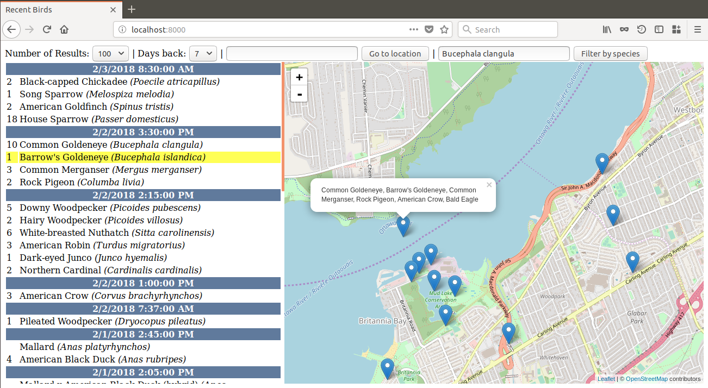

# Recent Birds

This was a little project to map recent bird sightings from
[eBird](https://ebird.org). My local field-naturalist's club used
to have a widget on their site that showed recent eBird data for
the area. At one point it was removed, possibly due to concerns
over reporting the locations of sensitive species like owls. I
decided to make my own version and add a map to make it easier to
see what was around. There were maps on eBird itself, but they
seemed slower and clunkier than what was possible using
[leaflet](http://leafletjs.com/) and
[openstreetmap](https://openstreetmap.org) data. The
[eBird API](https://confluence.cornell.edu/display/CLOISAPI/eBird+API+1.1) was very straightforward and the whole thing came
together in an afternoon.

I later added the ability to jump to a location using the
[Geolocation API](https://developer.mozilla.org/en-US/docs/Web/API/Geolocation/Using_geolocation) and when that was restricted to
HTTPS contexts I switched to using the
[nominatim](https://nominatim.openstreetmap.org/) API. This worked
well for quite a while, but eventually the eBird API I was using
was deprecated and stopped working.

The new version of the API requires using a API token which
really should be kept secret. It would be easy enough to write a
Flask app to wrap the API queries, update to the new version of
the eBird API and the latest version of leaflet, host it somewhere
where I can get a certificate for HTTPS and keep it going, but
that would be a pretty big departure from my original intentions
for this and I'm not certain it would be worth the effort.
